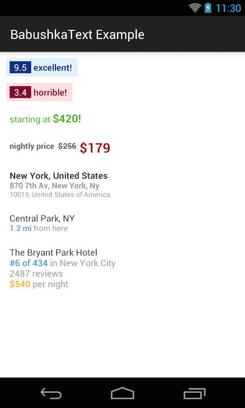

Butter Knife
============

BabushkaText is a TextView which lets you customize the styling of parts of your text via Spannables,
but without the hassle of having to deal directly with Spannable themselves.

 * Create complex style structures for your text without having to add multiple `TextViews` to your
 view hierarchy.
 * Eliminate `setSpan(Object what, int start, int end, int flags)` calls by using more convenient
 methods such as `.style(Typeface.BOLD)`, `.superscript()` and others.

Examples of what you can do with BabushkaText. Each item is a single TextView.


Example
--------
Generate the following style:


With this code:

```java
        BabushkaText babushka = (BabushkaText)findViewById(R.id.babushka_text);

        // Add the first piece "Central Park"
        babushka.addPiece(new BabushkaText.Piece.Builder("Central Park, NY\n")
                .textColor(Color.parseColor("#414141"))
                .build());

        // Add the second piece "1.2 mi"
        babushka.addPiece(new BabushkaText.Piece.Builder("1.2 mi ")
                .textColor(Color.parseColor("#0081E2"))
                .textSizeRelative(0.9f)
                .build());

        // Add the third piece "from here"
        babushka.addPiece(new BabushkaText.Piece.Builder("from here")
                .textColor(Color.parseColor("#969696"))
                .textSizeRelative(0.9f)
                .build());

        // Display the final, styled text
        babushka.display();
```

Download
--------
BabushkaText is a single Java file, so you can simply download it and reference it in your project.

License
-------

    Copyright 2014 Henrique Boregio

    Licensed under the Apache License, Version 2.0 (the "License");
    you may not use this file except in compliance with the License.
    You may obtain a copy of the License at

       http://www.apache.org/licenses/LICENSE-2.0

    Unless required by applicable law or agreed to in writing, software
    distributed under the License is distributed on an "AS IS" BASIS,
    WITHOUT WARRANTIES OR CONDITIONS OF ANY KIND, either express or implied.
    See the License for the specific language governing permissions and
    limitations under the License.